# Parametric Stackable Box

Stackable storage box with a lip that nests into the box below, plus battery, grid-divider, hex-bit, and SD-card inserts.

Play on [vary3d.com](https://vary3d.com/en/models/parametric-stackable-box).

## Source

Forked from https://github.com/likeablob/parametric-stackable-box
by likeablob. Upstream license: MIT.

Customizer comments, listing text, named presets, extra Models, and vendored `scad-utils`. Each Model is a complete article (organizers split with `part`). Box hull and lip are upstream. Battery, grid, hex-bit, and SD inserts live here: they expose the same `body_x` / `body_y` / `body_z` / `wall` as the empty box so the insert stays a fit, and they pack only full pockets.

## Files

### Models

Export the file you need.

#### Parametric Stackable Box

`model.scad`

| Name | Default | Range | What it does |
|---|---|---|---|
| body_x | 80 | [40:1:160] | Interior length of the box footprint. |
| body_y | 110 | [60:1:200] | Interior width of the box footprint. |
| body_z | 47 | [25:0.5:120] | Overall height, including the stacking lip. |
| wall | 1.6 | [0.8:0.4:4] | Wall thickness. |
| body_color | #2A9D90 | color | Hull render color. |

#### Battery Organizer

`battery-organizer.scad`

| Name | Default | Range | What it does |
|---|---|---|---|
| part | all | [all:All, tray:Tray, box:Box] | All = assembled preview. Pick a kind to export STL. |
| tray_color | #2A9D90 | color | Hull render color. |
| body_x | 80 | [40:1:160] | Interior length of the box footprint. |
| body_y | 110 | [60:1:200] | Interior width of the box footprint. |
| body_z | 47 | [25:0.5:120] | Overall height, including the stacking lip. |
| wall | 1.6 | [0.8:0.4:4] | Wall thickness. The tray follows this so it still fits the box in this file. |
| battery | aa | [aaa:AAA, aa:AA, 18650:18650] | Cell type. Well diameter is the cell plus 1 mm clearance. |

#### Bit Organizer

`bit-organizer.scad`

| Name | Default | Range | What it does |
|---|---|---|---|
| part | all | [all:All, tray:Tray, box:Box] | All = assembled preview. Pick a kind to export STL. |
| tray_color | #2A9D90 | color | Hull render color. |
| body_x | 80 | [40:1:160] | Interior length of the box footprint. |
| body_y | 110 | [60:1:200] | Interior width of the box footprint. |
| body_z | 47 | [25:0.5:120] | Overall height, including the stacking lip. |
| wall | 1.6 | [0.8:0.4:4] | Wall thickness. The tray follows this so it still fits the box in this file. |
| bit | hex_1_4_short | [hex_1_4_short:1/4 in short, hex_1_4_long:1/4 in long] | 1/4 in hex. Short fits in the default box; long needs Tall. |

#### Generic Organizer

`generic-organizer.scad`

| Name | Default | Range | What it does |
|---|---|---|---|
| part | all | [all:All, divider:Divider, box:Box] | All = assembled preview. Pick a kind to export STL. |
| divider_color | #2A9D90 | color | Hull render color. |
| body_x | 80 | [40:1:160] | Interior length of the box footprint. |
| body_y | 110 | [60:1:200] | Interior width of the box footprint. |
| body_z | 47 | [25:0.5:120] | Overall height, including the stacking lip. |
| wall | 1.6 | [0.8:0.4:4] | Wall thickness. The divider follows this so it still fits the box in this file. |
| grid_x | 2 | [1:1:6] | Pockets along interior length. |
| grid_y | 2 | [1:1:6] | Pockets along interior width. |

#### Sd Organizer

`sd-organizer.scad`

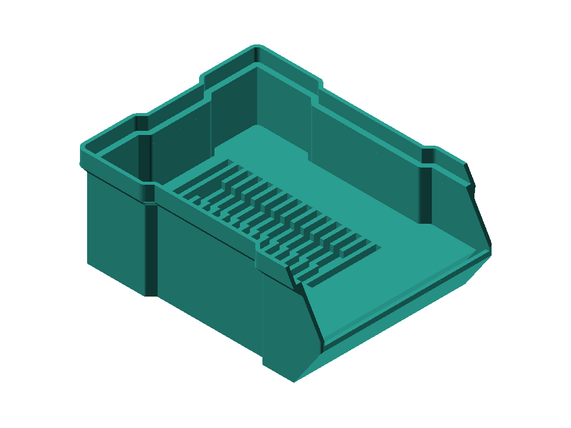

| Name | Default | Range | What it does |
|---|---|---|---|
| part | all | [all:All, tray:Tray, box:Box] | All = assembled preview. Pick a kind to export STL. |
| tray_color | #2A9D90 | color | Hull render color. |
| body_x | 80 | [40:1:160] | Interior length of the box footprint. |
| body_y | 110 | [60:1:200] | Interior width of the box footprint. |
| body_z | 47 | [25:0.5:120] | Overall height, including the stacking lip. |
| wall | 1.6 | [0.8:0.4:4] | Wall thickness. The tray follows this so it still fits the box in this file. |
| card | sd | [sd:SD, microsd:microSD (TF), mixed:Mixed] | SD, microSD, or mixed. TF uses the microSD size. Mixed leaves a TF strip. |

### Libraries

`geometry.scad`

Module helpers. Not a build root.

`scad-utils/`

Oskar Linde scad-utils (vendored `scad-utils/`, MIT). Site preview uses the copy in this folder.

## Presets

### Standard

Default box height.

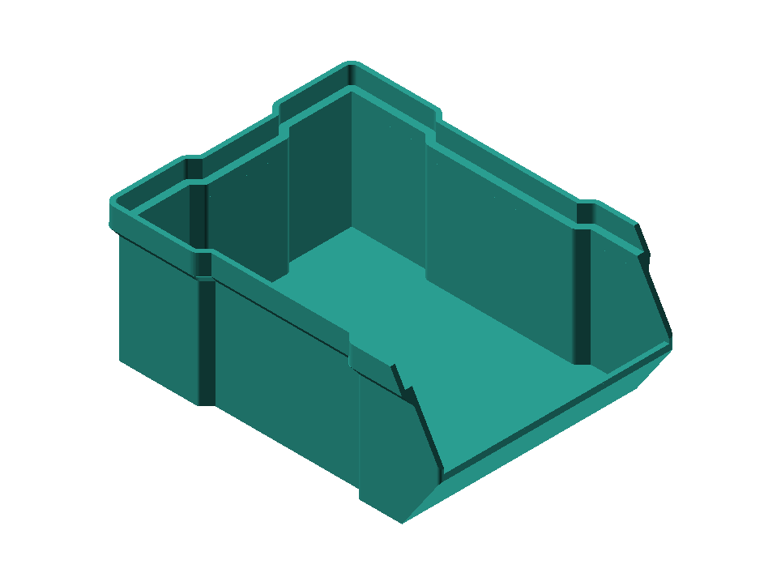

| Name | Value |
|---|---|
| body_z | 47 |

### Tall

1.5× body height, matching the upstream tall variant.

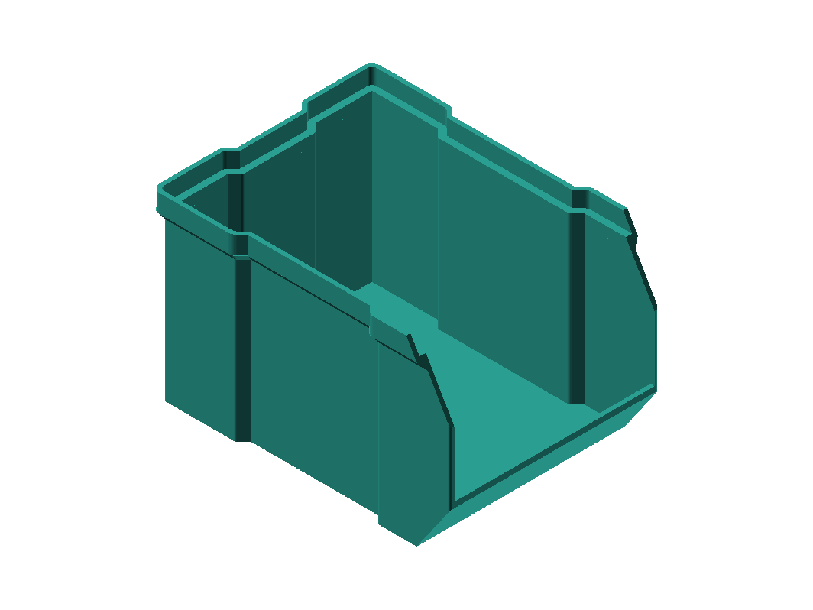

| Name | Value |
|---|---|
| body_z | 70.5 |

### AA

AA cells. Default well diameter.

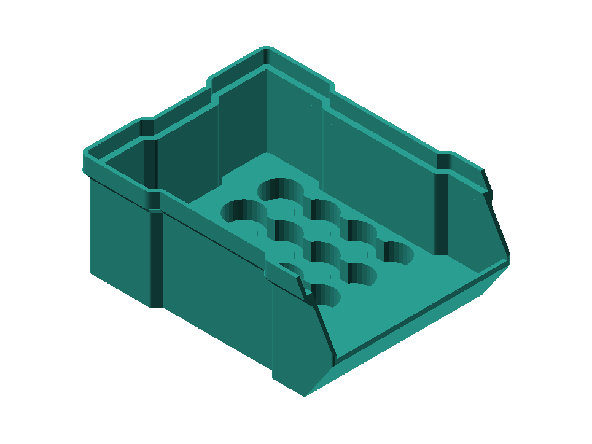

| Name | Value |
|---|---|
| battery | aa |

### AAA

AAA cells. Smaller wells, more pockets.

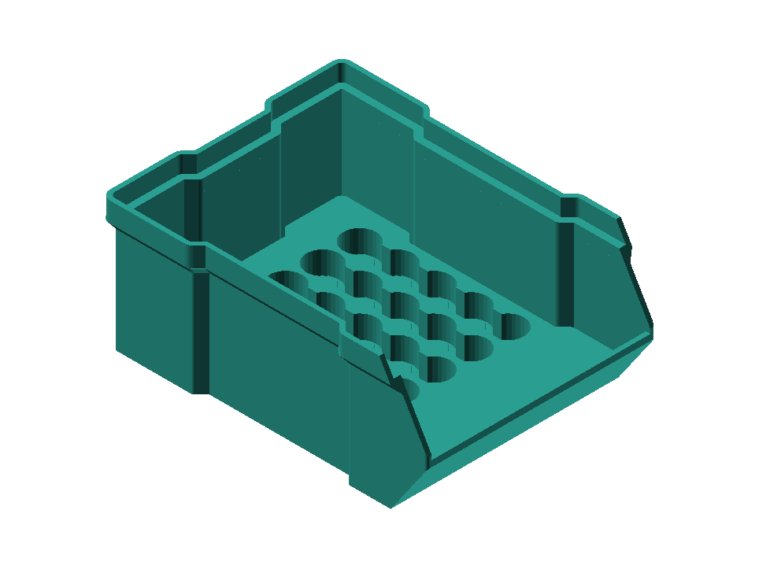

| Name | Value |
|---|---|
| battery | aaa |

### 18650

18650 cells. Larger wells, fewer pockets.

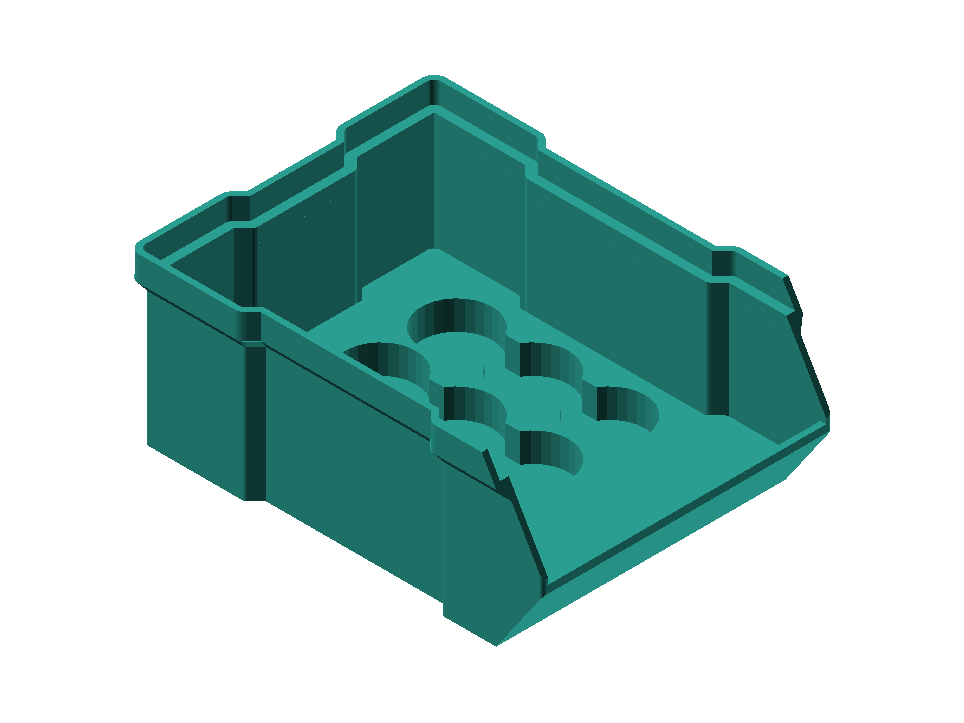

| Name | Value |
|---|---|
| battery | 18650 |

### 1x2

One row of two pockets. Long parts or pens.

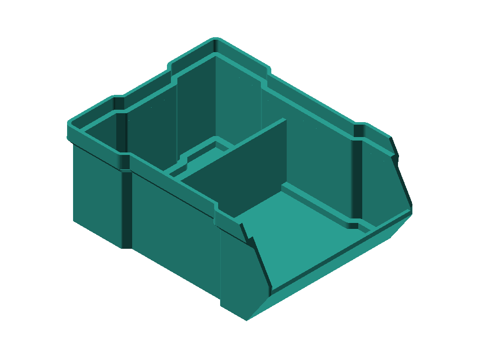

| Name | Value |
|---|---|
| grid_x | 1 |
| grid_y | 2 |

### 2x2

Four pockets. Matches the upstream 2×2 divider.

| Name | Value |
|---|---|
| grid_x | 2 |
| grid_y | 2 |

### 2x3

Six pockets. Screws and small hardware.

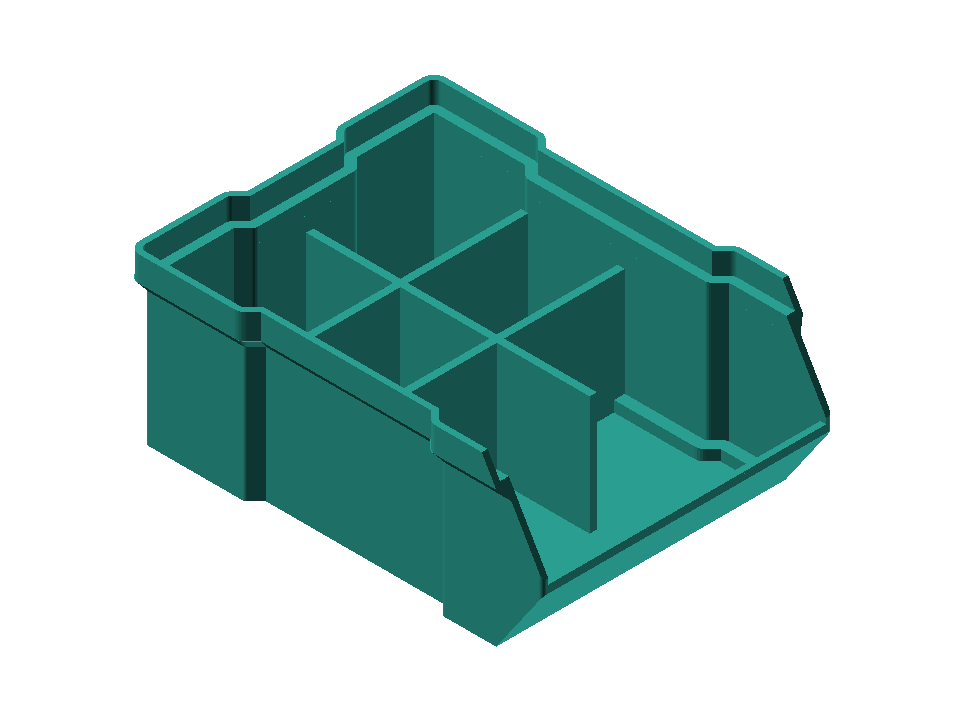

| Name | Value |
|---|---|
| grid_x | 2 |
| grid_y | 3 |

### 3x3

Nine pockets. Components and beads.

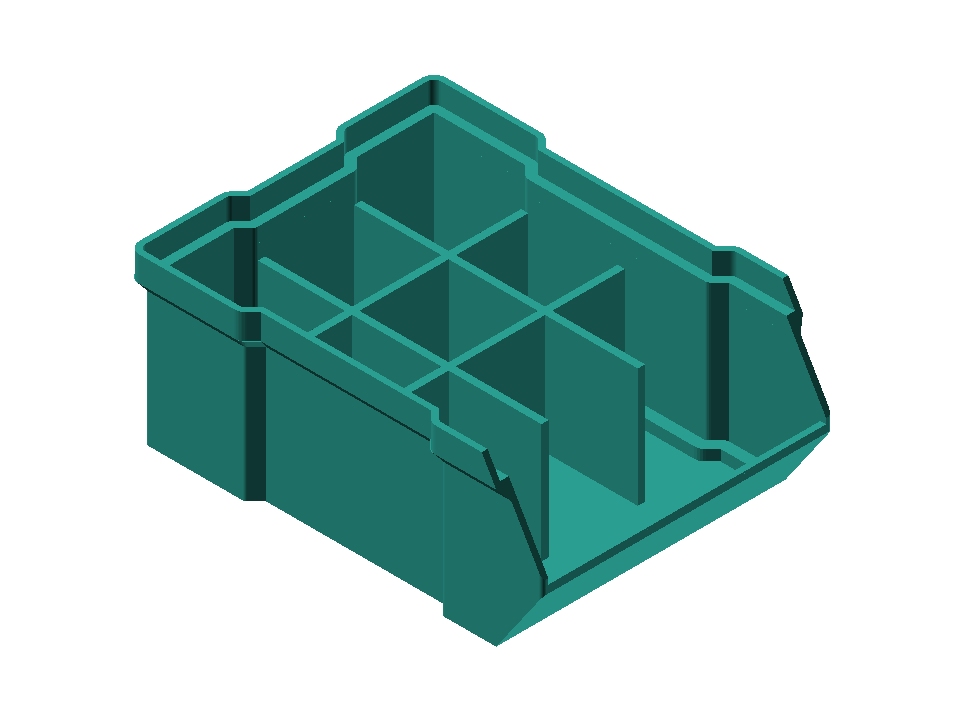

| Name | Value |
|---|---|
| grid_x | 3 |
| grid_y | 3 |

### 1/4 in short

1/4 in hex bits, ~25 mm. Fits the default box height.

| Name | Value |
|---|---|
| bit | hex_1_4_short |

### 1/4 in long

1/4 in hex bits, ~50 mm. Tall box so the bits stay under the lip. A full tray should not take a box on top if bits sit proud.

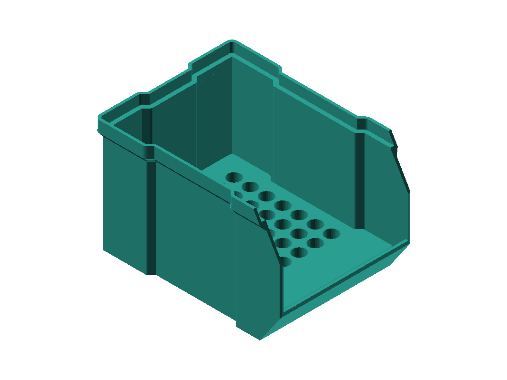

| Name | Value |
|---|---|
| bit | hex_1_4_long |
| body_z | 70.5 |

### SD

Full-size SD slots. Count follows the box footprint.

| Name | Value |
|---|---|
| card | sd |

### microSD

microSD (TF) slots. Count follows the box footprint.

| Name | Value |
|---|---|
| card | microsd |

### Mixed

SD columns plus a microSD (TF) strip. Drops an SD column rather than growing the box.

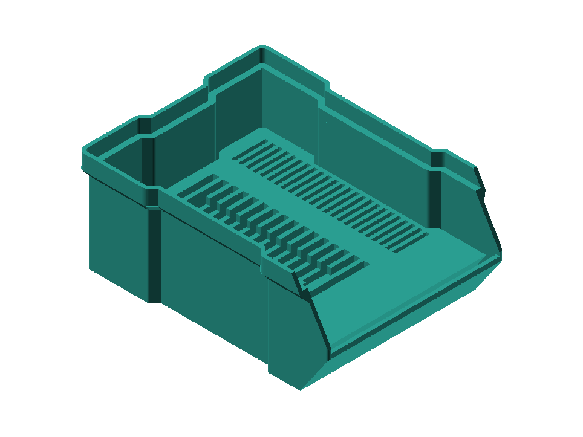

| Name | Value |
|---|---|
| card | mixed |

## Print

- **Settings:** PLA, 0.2 mm layer, 2 walls, 15% gyroid infill, no supports.
- **Orientation:** Print the box on its floor, stacking lip up. Print the tray and the divider on their floors.
- **Why:** The front scoop is 35°, so it prints without supports.
- **Parts:** Each Model is a complete article. Empty box: Print 1× from `model.scad`. Battery, hex-bit, or SD: Print 1× box and 1× tray from that file. Grid divider: Print 1× box and 1× divider from `generic-organizer.scad`. `part=all` is assembled preview only — do not slice it.
- **Fit:** Default interior is 80 × 110 × 47 mm so empty boxes, trays, and dividers stack as one family. Height may mix (Standard under Tall). On an organizer file, `body_x` / `body_y` / `body_z` / `wall` move the box and the insert together. Changing XY is a new family and will not nest with Standard. Pocket count follows the keepout after the front scoop; it does not grow the default box.

## License

MIT.

Copyright (c) 2019 likeablob
